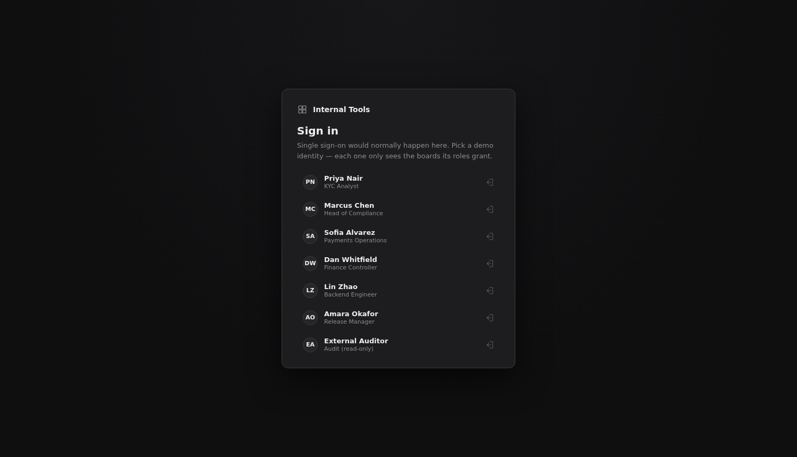
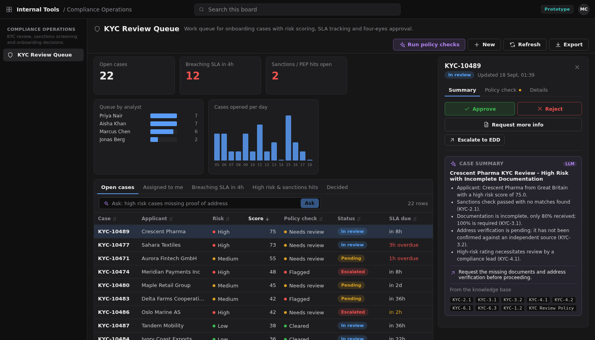
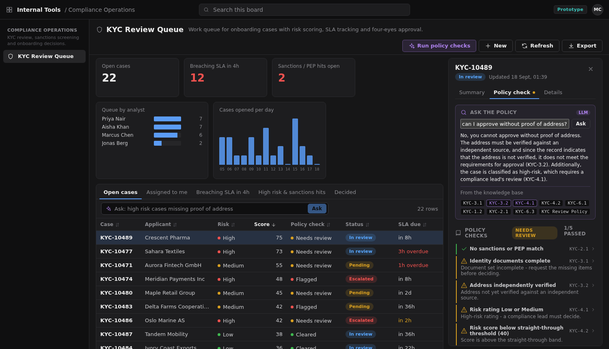
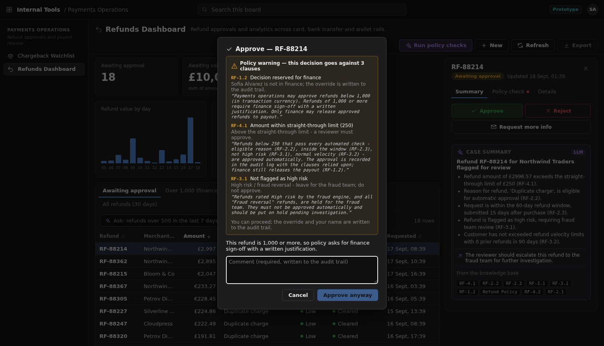
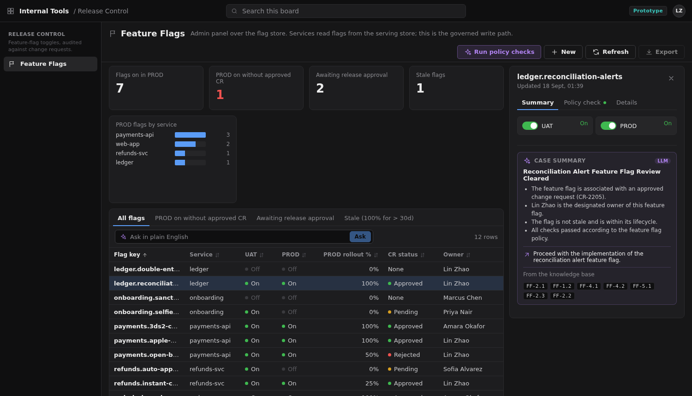

# Internal Tools Platform — a Power Apps alternative built with Devin

Prototype exploring how a fintech engineering team could use **Devin Cloud** to get the thing
Power Apps actually sells — *"describe a table, get a governed back-office app"* — while
keeping everything in a normal code repo, and adding the things Power Apps + Copilot cannot:
policy-aware automation and AI inside the tools.

```
tools/kyc_queue.yaml       ─┐
tools/refunds.yaml          ├─►  server/  FastAPI + SQLite: records, actions, dashboards, audit,
tools/feature_flags.yaml    │             export gating, policy checks, AI summary / NL query
tools/chargebacks.yaml     ─┘                     │
tools/_users.yaml            roles                ▼
knowledge/*.md               policies (citable)   web/  React shell: sign-in, role-scoped boards,
                                                        sortable grid, detail pane, dark theme

.devin/skills/new-tool/SKILL.md          /new-tool → scaffold a governed app
.devin/playbooks/new-internal-tool.md    full recipe: scaffold → SSO/RBAC → audit → policy → PR
environment.yaml                         reproducible Devin snapshot (deps, DB, seed, build, :8000)
.env.example                             secret *names* only; values live in Devin's secrets store
```

**One YAML = one app.** Fields, views, actions, dashboard tiles, permissions, policy checks and
auto-review are declared; `server/` and `web/` never change when a tool is added. The fourth
tool (Chargeback Watchlist) was added after the platform was finished: 92 lines of YAML, zero
platform code, all governance tests inherited.

**Start here**

| I want to… | Section |
|---|---|
| Run it on my laptop (`uvicorn`, http://localhost:8000) | [Run it locally](#run-it-locally) |
| Run it on minikube and open it at http://localhost:8080 | [Run it on minikube](#run-it-on-minikube-docker--kubernetes) → *Open it on localhost* |
| Build one image per board, or add a new image | [Run it on minikube](#run-it-on-minikube-docker--kubernetes) → *Adding another image* |
| Turn on OpenAI (LLM + embeddings) locally or in the cluster | [Configure OpenAI](#configure-openai-llm--embedding-model) |
| Add or change a policy rule the AI and checks use | [Maintaining the knowledge base](#maintaining-the-knowledge-base-for-ops-compliance-and-engineering) |
| Add a whole new tool from a paragraph | `/new-tool` skill (`.devin/skills/new-tool/SKILL.md`) |
| See what it looks like | [Feature tour](#feature-tour) |

## What it replicates from Power Apps

| Power Apps concept | Here |
|---|---|
| Dataverse table + columns | `fields:` → SQLite table (additive migrations on change) |
| Views / view selector | `views:` with filters, default sort (high risk first), "assigned to me"; decided records leave the queue |
| Model-driven form | auto-generated detail pane (single click), inline edit of permitted fields |
| Command bar | `actions:` in the pane with role, state guard, required comment, confirm dialog |
| Power Automate flow | `webhook:` on an action — payload HMAC-signed with `WEBHOOK_SIGNING_SECRET`, logged under *Integrations* |
| Dashboard tiles / charts | `dashboard:` KPI, group (donut / bars), series |
| Security roles + model-driven app per persona | `permissions:` per role; tools grouped into boards (`app:`); a user only sees boards their roles grant |
| Column-level security | `visible_to:` + `mask: last4` — masked in grid, sort, search, audit, export **and AI payloads** |
| `prvExportToExcel` privilege | `permissions.export` — exports are also audited |
| Auditing | `audit_log` with actor (human or `devin-ai`), action, comment, before/after |
| Entra ID sign-in | sign-in page + profile menu; demo header today, one function to swap for OIDC |
| Copilot in the app | case summary + plain-English queries compiled to the grid's own validated filter |
| Business rules | `knowledge/*.md` clauses cited by `checks:`; `auto_review` clears / flags with a clause reference |
| Templates / maker | `/new-tool` skill + playbook; Devin opens the PR |

## Feature tour

Screenshots from the all-in-one instance (`make minikube` → `make forward` → http://localhost:8080;
regenerate with `APP_URL=http://localhost:8080 node scripts/feature_shots.mjs`).

**Sign-in and role-scoped boards** — personas carry roles from `tools/_users.yaml`; a user only sees the
boards their roles grant, and every action is recorded against them.



**Schema-driven board** — one YAML gives the KPI tiles, charts, views, sortable grid (risk first,
masked columns), the detail pane with Summary / Policy check / Details tabs, and the decision
buttons; the AI case summary cites the clauses it relied on.



**Policy checks grounded in the knowledge base** — each record is judged against cited clauses from
`knowledge/*.md`; *Ask the policy* answers from the same indexed clauses (`KYC-3.2`, `KYC-4.1`, …).



**Advisory governance with an audit trail** — decisions are never greyed out; a decision that goes
against policy shows the clauses, requires a comment, and is written to the audit log as an override.



**More boards, same platform** — the feature-flag admin panel (UAT / PROD state, change-request
status, kill switch) is another YAML file; refunds and chargebacks likewise.



## AI inside the tools

- **Case summary** at the top of every detail pane: headline, bullets, recommendation, built
  from the fields the current user can see, the policy check results and recent history.
- **Ask in plain English** above every grid: *"high-risk cases missing proof of address"*,
  *"refunds over 500 in the last week by reason"* → a validated filter on visible fields,
  rendered in the same grid, audited as `ai:query`.
- **Policy automation**: each record is checked against cited clauses (KYC-2.1, RF-4.1, …).
  All checks pass → `devin-ai` runs the tool's clear action; a `flag` check fails → escalates;
  anything else stays for a human, with the clauses shown in the pane. Every run returns an
  evidence report (outcome, action, clause codes per record); opening the record shows each
  check, the values it was judged on, the rule and the clause text. Humans with `update` rights
  can undo an automated decision per record (**Reset AI decision**) or all at once
  (`POST /ai-reset`): the pre-review values are restored and the reset is audited as the human,
  never over a later human decision.
- **Ask the policy** in every detail pane: *"can I approve this without the missing document?"*
  → the question (plus the record's non-protected fields) is matched against the knowledge
  base, the top clauses are handed to the model, and the answer cites them (`KYC-1.2`, …).
  Clicking a citation shows the clause text, the source document and the similarity score.
  Audited as `ai:ask` with the clauses retrieved and the ones the answer relied on.
- **Knowledge base**: the AI never reads the Markdown files directly. At startup each
  `knowledge/*.md` is split into one chunk per clause, embedded (OpenAI
  `text-embedding-3-small`) and stored in SQLite (`kb_chunks`); summaries and answers retrieve
  from that index (`server/kb.py`). Unchanged clauses are not re-embedded (content hash).
  Without an API key or on quota errors the index runs on a local hashed-TF-IDF vector so
  search still works offline. `GET /api/knowledge/status` shows backend, model and chunk count;
  `GET /api/knowledge/search?q=…` searches it; `POST /api/knowledge/reindex` reloads the docs.
- **Providers**: `OPENAI_API_KEY` present → OpenAI (`OPENAI_MODEL`, default `gpt-4o-mini`),
  strict-JSON, schema-validated, falls back automatically on error / quota. Absent → a
  deterministic rules provider, so the demo and tests never depend on a network call.
  Protected fields are dropped before anything leaves the process.

## Maintaining the knowledge base (for ops, compliance and engineering)

The AI in each board only knows what is in these files — if a rule is not written here it
cannot cite it, clear on it or answer questions about it. When policy changes, change the file:

| New information about… | Edit this file | Clause prefix | Used by |
|---|---|---|---|
| KYC / onboarding review, sanctions, documents, risk bands | `knowledge/kyc_review_policy.md` | `KYC-` | KYC Review Queue |
| Refunds, approval limits, fraud holds, refund windows | `knowledge/refund_policy.md` | `RF-` | Refunds Dashboard |
| Feature flags, change requests, rollouts, kill switch | `knowledge/feature_flag_policy.md` | `FF-` | Feature Flags |
| Platform / design / audit conventions for *building* tools | `knowledge/platform_conventions.md` | `PLAT-` | Devin when scaffolding new tools |

**How to write it so the AI can use it**

1. One rule per clause, under a level-3 heading with a code: `### RF-2.4 Partial refunds`.
   Codes are `PREFIX-section.number`; never reuse or renumber an existing code — add a new one
   (`RF-2.4`, `RF-2.5`…) so old audit entries keep pointing at the right rule.
2. Write the rule as a complete, standalone paragraph in plain language, with the concrete
   thresholds, roles and time limits ("below 1,000", "finance", "60 days"). Each clause is
   retrieved on its own, so it must make sense without the clauses around it.
3. Say who may do what, and keep an explicit "What automation may do" clause per policy so
   reviewers can see the boundary the automated checks are allowed to work within.
4. Writing the clause is enough for the AI to *cite* it (summaries, Ask the policy). To have
   it *enforced*, add a `checks:` entry in the tool's YAML that cites the code
   (`clause: RF-2.4`, `when: {amount: {lt: 1000}}`) — that is what lets `devin-ai` clear or
   escalate a record. The server refuses to start if a check cites a clause that does not
   exist, so a typo cannot ship.
5. Open a pull request. Policy is code: a compliance lead reviews the diff, CI runs the
   governance tests (`python -m pytest -q`), and the change is traceable in git history.
6. Once merged and deployed the server re-indexes on startup; on a running instance call
   `POST /api/knowledge/reindex` (any signed-in user) to pick the change up immediately.
   Only the clauses whose text changed are re-embedded.

**Worked example — add a rule and have it enforced.** Say refunds older than 90 days now need
finance sign-off.

```markdown
# knowledge/refund_policy.md  (append after RF-1.2)
### RF-1.3 Refunds after 90 days
A refund requested more than 90 days after the original purchase requires finance sign-off
regardless of amount. Payments ops may only request more information; finance approves or rejects.
```

```yaml
# tools/refunds.yaml  (add to checks: — a check passes when `when` matches the record)
  - id: late_refund
    clause: RF-1.3
    title: Requested within 90 days (else finance sign-off)
    when: {days_since_purchase: {lte: 90}}
    on_fail: review          # review = needs a human; flag = policy breach, devin-ai escalates
    pass_text: Inside 90 days.
    fail_text: Over 90 days since purchase - finance must sign off.
```

Then `python -m pytest -q` (the server refuses to start if `RF-1.3` does not resolve to a heading),
open a PR, and after deploy call `POST /api/knowledge/reindex` — or just restart the pod.
`GET /api/knowledge/search?q=90+days` should now return the clause, and every refund's Policy check
tab shows the new line.

A new policy area (say, payouts) is a new file `knowledge/payout_policy.md` with its own
prefix (`PO-`); the loader picks up every `.md` in the folder automatically, and a new tool
references it with `auto_review: {policy: payout_policy}`. Don't put merchant, customer or
identity data in these files — they are policy, they are sent to the embedding provider, and
they are visible to every signed-in user.

**Where the KB lives at runtime.** The Markdown in `knowledge/` is the source of truth (git). Every
image copies it to `/app/knowledge/` (all policies ship in every image, including single-board
ones, so cross-policy questions still work). On boot each instance indexes the clauses into the
`kb_chunks` table of its own SQLite file (`/data/data.db` on that instance's volume) — one index
per instance, rebuilt from the Markdown, never edited by hand.

## Run it locally

**Prerequisites: Python 3.10+ and Node 18+.** macOS ships Python 3.9 with the Xcode
command-line tools, which is too old, and has no Node — install both first (macOS via
[Homebrew](https://brew.sh); on Linux `apt install python3.12 python3.12-venv nodejs npm`):

```bash
brew install python@3.12 node
python3.12 --version && node --version
```

Then clone, create a venv (Windows: `py -3.12 -m venv .venv && .venv\Scripts\activate`), build the
static UI into `web/dist`, seed `data.db` with synthetic demo data and start the server:

```bash
git clone https://github.com/yyf20001230/devin-internal-tool && cd devin-internal-tool
python3.12 -m venv .venv && source .venv/bin/activate
pip install -r requirements.txt
npm --prefix web ci && npm --prefix web run build
export OPENAI_API_KEY=sk-...
python -m server.seed
uvicorn server.main:app --host 0.0.0.0 --port 8000
```

`export OPENAI_API_KEY` is optional (live LLM + OpenAI embeddings). Open http://localhost:8000 and pick a demo identity. Without `OPENAI_API_KEY` everything
still works on the offline rules engine and lexical embeddings (the AI panels say "rules"
instead of "LLM"). `python -m pytest -q` runs the 58 governance / policy / AI / KB tests.

After changing anything under `web/src`, run `npm --prefix web run build` again and hard-refresh
the browser; the server serves the built files. Alternatively `npm --prefix web run dev` starts a
hot-reloading dev server on :5173 that proxies the API to :8000.

Optional: copy `.env.example` to `.env` and set `OPENAI_API_KEY` for live LLM output and
`WEBHOOK_SIGNING_SECRET` for signed webhook payloads — see [Configure OpenAI](#configure-openai-llm--embedding-model).
In Devin Cloud these come from the Secrets store; nothing in the repo ever holds a value.

**Working a queue fast:** rows show only what you need to triage; open a record for the full
detail in a three-tab pane: **Summary** (AI case summary + Approve / Reject / Request more info,
environment switches on boolean fields, plus any secondary actions), **Policy check** (the clause
checks and the Ask-the-policy box) and **Details** (every field, edit, audit trail). Which action
fills each decision slot comes from `decision: approve|reject|info` on the tool's YAML actions; a
boolean field becomes a switch when an action `set`s it (flags: UAT / PROD). Decision buttons only
show when the record is in a state where they apply, and grey out only for a missing role. ↑/↓ move
through the queue, Enter opens the record, Esc closes it. Acting on an open record advances to
the next one in the queue.

Sign in as a demo identity — each sees only the boards its roles grant:

| User | Roles | Board(s) | What to look at |
|---|---|---|---|
| Priya | analyst | Compliance Ops | ID document / DOB masked; escalate / request docs; cannot approve or export |
| Marcus | compliance_lead, analyst | Compliance Ops | sees masked columns, approve / reject (comment), export, run policy review |
| Sofia | payments_ops | Payments Ops | refunds < 1,000; bank account masked; approve small / request info |
| Dan | finance, payments_ops | Payments Ops | approves > 1,000, sends to payout (signed webhook), exports |
| Lin | engineer | Release Control | UAT / PROD switches and kill switch; PROD without an approved CR is *flagged* (FF-2.1), not blocked |
| Amara | release_manager, engineer | Release Control | approves / rejects change requests |
| External Auditor | readonly | Compliance + Payments | sees everything, changes nothing, sensitive columns masked |

`Devin AI` is a service identity: it appears in audit history as the actor of automated
decisions and cannot sign in.

## Run it on minikube (Docker + Kubernetes)

The same app ships as a container image (`Dockerfile`: Node builds the UI, a slim Python
image serves API + UI on :8000) plus Kubernetes manifests in `deploy/k8s/` (Kustomize base +
one overlay per instance: ConfigMap, PVC for the SQLite file, Deployment, NodePort Service). The
pod seeds the demo data the first time its volume is empty, then keeps it across restarts.

Two ways to cut it:

| | Image | Overlay | Port |
|---|---|---|---|
| All boards in one app (`TOOL=all`, default) | `internal-tools:dev` | `deploy/k8s/overlays/all` | 30080 |
| KYC only | `internal-tools-kyc:dev` | `deploy/k8s/overlays/kyc` | 30081 |
| Refunds only | `internal-tools-refunds:dev` | `deploy/k8s/overlays/refunds` | 30082 |
| Feature flags only | `internal-tools-flags:dev` | `deploy/k8s/overlays/flags` | 30083 |

A per-tool image is the same Dockerfile built with `--build-arg TOOLS=<id>`: it copies
`tools/`, then deletes every definition except the selected one(s) (`deploy/select_tools.py`),
and bakes `TOOLS=<id>` into the environment so the server loads, seeds and serves only that
board; `_users.yaml`, the `knowledge/` policies and the UI are shared. The sign-in page lists
only personas who have a board on that instance. Each instance gets its own Deployment, Service,
PVC (so its own SQLite file and audit log); they share the namespace and the OpenAI Secret.

**Prerequisites:** Docker Desktop (running), [minikube](https://minikube.sigs.k8s.io/docs/start/),
kubectl and make:

```bash
brew install minikube kubectl
minikube version && kubectl version --client
```

(macOS; on Linux follow the minikube link above.) Then, from the repo, pick **one** of:

| Command | What you get |
|---|---|
| `make minikube` | start the cluster, build `internal-tools:dev`, deploy the all-in-one instance |
| `make split` | three images + three instances (KYC, refunds, flags) |
| `make minikube TOOL=kyc` | just one per-tool instance (`kyc`, `refunds` or `flags`) |

```bash
cd devin-internal-tool
git checkout main && git pull
export OPENAI_API_KEY=sk-...
make minikube
```

`export OPENAI_API_KEY` is optional — omit it for the offline rules / lexical mode. The first
`make minikube` takes a few minutes (cluster start + image build); later runs reuse both.

**Troubleshooting**

- `make: *** No rule to make target 'minikube'` — your checkout predates the minikube work.
  `git checkout main && git pull`, then `grep -n '^minikube:' Makefile` should print the target.
  The Makefile is tested with GNU make 3.81 (the one macOS ships) and 4.x.
- `zsh: unknown file attribute: K` / `command not found: #` — a trailing `# comment` was pasted
  along with the command. Plain macOS zsh does not treat `#` as a comment on an interactive line,
  so `(KYC, refunds, flags)` is parsed as a glob qualifier. Paste commands only, one per line
  (the code blocks in this README contain no comments for that reason).
- `zsh: command not found: minikube` — install the prerequisites above (Docker Desktop must be running).

### Open it on localhost

With the Docker driver (the default on macOS/Windows) the cluster's NodePorts are **not** reachable
from your machine, so map an instance to a local port with `kubectl port-forward` — wrapped as
`make forward`:

| Command | Opens | Notes |
|---|---|---|
| `make forward` | all-in-one → http://localhost:8080 | foreground; Ctrl-C stops it |
| `make forward TOOL=kyc` | KYC → http://localhost:8081 | |
| `make forward TOOL=refunds` | Refunds → http://localhost:8082 | |
| `make forward TOOL=flags` | Feature flags → http://localhost:8083 | |
| `make split-forward` | all three per-tool forwards, in the background | `make unforward` stops them |

```bash
make forward
```

Open http://localhost:8080 and sign in. Under the hood: `kubectl -n internal-tools port-forward svc/internal-tools 8080:80`.
On Linux the NodePort URLs also work directly (`make url` / `make urls` print them, e.g. `http://192.168.49.2:30080`).

### Which images exist, and what is inside

```bash
minikube image ls | grep internal-tools
make status
kubectl -n internal-tools exec deploy/internal-tools-kyc -- ls /app/tools /app/knowledge
```

(the app images loaded into the cluster; pods, services and PVCs in the namespace; what one image ships.)

Each image is ~73 MB (`python:3.12-slim`, non-root user 10001, UI pre-built), contains only the
selected `tools/*.yaml` plus `_users.yaml`, every `knowledge/*.md`, and stores its SQLite file on its
own PVC (`internal-tools-data[-<tool>]`) so the boards never share data or audit logs.

### Adding another image

Any tool id in `tools/*.yaml` can become its own image. The Chargeback Watchlist is wired up as a
worked example (not part of `make split` by default):

```bash
make minikube TOOL=chargebacks && make forward TOOL=chargebacks
```

opens it at http://localhost:8084.

## Configure OpenAI (LLM + embedding model)

Everything runs without a key — the AI panels then say **rules** (deterministic provider) and the
knowledge base uses a local hashed-TF-IDF embedding. With a key the same code paths use OpenAI:

| Variable | Default | What it drives |
|---|---|---|
| `OPENAI_API_KEY` | *(unset → offline)* | Enables the OpenAI provider **and** OpenAI embeddings. Secret. |
| `OPENAI_MODEL` | `gpt-4o-mini` | Case summaries, plain-English queries, Ask-the-policy answers (strict JSON, schema-validated) |
| `OPENAI_EMBEDDING_MODEL` | `text-embedding-3-small` | Vector for every policy clause in `kb_chunks` and for each search query |
| `WEBHOOK_SIGNING_SECRET` | *(unset → payloads marked unsigned)* | HMAC signature on outbound webhooks. Secret. |

How to set them, per way of running:

1. **Local uvicorn** — export in the shell before starting (or put them in `.env`, copied from
   `.env.example`). The two model exports are optional overrides.

   ```bash
   export OPENAI_API_KEY=sk-...
   export OPENAI_MODEL=gpt-4o-mini
   export OPENAI_EMBEDDING_MODEL=text-embedding-3-small
   python -m server.seed && uvicorn server.main:app --port 8000
   ```

2. **minikube** — the key goes into a Kubernetes Secret (`internal-tools-secrets`) shared by every
   instance; `make secret` creates/updates it from your shell and restarts all pods. Models live in
   the ConfigMap: edit `deploy/k8s/base/configmap.yaml` (`OPENAI_MODEL` / `OPENAI_EMBEDDING_MODEL`),
   then `make deploy` (or `make split-deploy`).

   ```bash
   export OPENAI_API_KEY=sk-...
   make secret
   ```

3. **Devin Cloud** — add `OPENAI_API_KEY` / `WEBHOOK_SIGNING_SECRET` in Settings → Secrets; every
   session gets them as environment variables.

Check what an instance is actually using:

```bash
curl -s -H 'X-User: marcus' http://localhost:8080/api/knowledge/status
```

```json
{"backend":"openai","model":"text-embedding-3-small","configured":"openai","chunks":53,"docs":["..."],"indexed_at":"...","last_error":null}
```

`"backend":"lexical"` means it is running offline (no key, or it fell back after an API error shown in `last_error`).

Rules the code enforces regardless of provider: protected/masked fields are removed before any
payload leaves the process; model output is validated against the tool schema; every AI call is
audited (`ai:summary`, `ai:query`, `ai:ask`); on an API error or quota exhaustion the request falls
back to the rules provider instead of failing. Switching embedding model re-embeds every clause on the
next start (the cache is keyed by model + content hash); unchanged clauses under the same model are
never re-embedded. Never commit a key: `.env` is gitignored, `.env.example` holds names only, and a
test fails if a signing key appears in a tracked file.

## Devin Cloud features used

| Feature | File | Power Apps analogue |
|---|---|---|
| Skill / slash command | `.devin/skills/new-tool/SKILL.md` | "Start from template" |
| Playbook | `.devin/playbooks/new-internal-tool.md` | The maker + ALM pipeline, as a checklist |
| Knowledge | `knowledge/platform_conventions.md` (+ policy docs, indexed into the in-app KB) | Environment strategy / CoE standards |
| Declarative environment | `environment.yaml` | Managed environment provisioning |
| Secrets store | `.env.example` (names), `os.environ` (reads) | Connection references / Key Vault |

See `docs/EVALUATION.md` for the build-vs-buy assessment and `docs/COST_COMPARISON.md` for the
annual cost of Power Apps vs this platform at 1,000 users.
